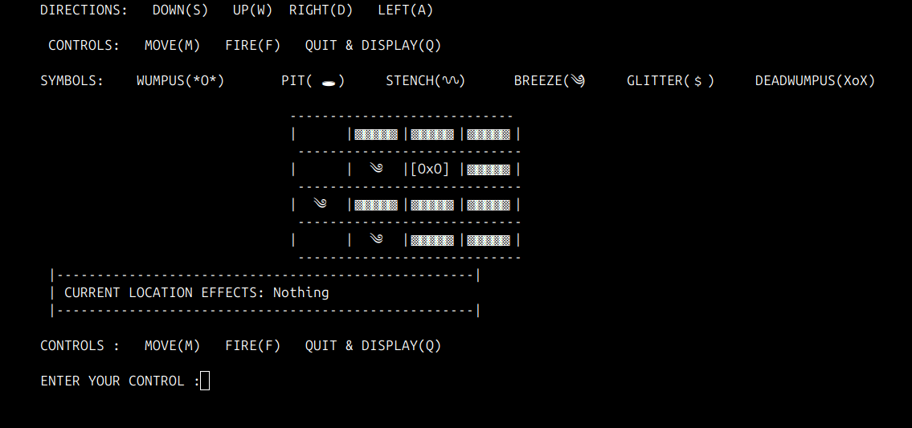

# Wumpus World

Welcome to the Wumpus World project! This README provides an overview of the project, including its purpose, rules, and how to get started.



## Project Overview

Wumpus World is a classic artificial intelligence problem used to illustrate the concepts of knowledge representation, reasoning, and decision-making under uncertainty. The game is set in a grid-based world where the player must navigate through rooms to find gold while avoiding hazards such as pits and the Wumpus.

## Game Rules

1. **Grid Layout**: The world is represented as a grid of rooms. Each room can contain hazards or be empty.
2. **Player**: The player starts in a specific room and can move to adjacent rooms (up, down, left, right).
3. **Wumpus**: A dangerous creature that can kill the player if they enter its room. The Wumpus can be in any room except the starting room.
4. **Pits**: Deadly traps that can also kill the player if they enter a room containing a pit.
5. **Gold**: The objective of the game is to find and retrieve the gold. The player wins by finding the gold and returning to the starting room.
6. **Percepts**: The player receives percepts that provide clues about the adjacent rooms:
   - **Stench**: Indicates the Wumpus is in an adjacent room.
   - **Breeze**: Indicates a pit is in an adjacent room.
   - **Glitter**: Indicates the gold is in the current room.
7. **Actions**: The player can perform the following actions:
   - **Move**: Move to an adjacent room.
   - **Grab**: Pick up the gold if it is in the current room.
   - **Shoot**: Fire an arrow in a straight line to kill the Wumpus.
   - **Climb**: Climb out of the cave if the player is in the starting room.

## Getting Started

To get started with the Wumpus World project, follow these steps:

1. **Clone the Repository**: Clone the project repository to your local machine using the following command:

   ```bash
   git clone https://github.com/yourusername/WumpusWorld.git
   ```

2. **Navigate to the Project Directory**: Change to the project directory:

   ```bash
   cd WumpusWorld
   ```

3. **Install Python**: Ensure you have Python installed on your machine. You can download it from the [official Python website](https://www.python.org/).

   ```bash
   python --version
   ```

4. **Run the Game**: Start the game by running the main script:
   ```bash
   python game.py
   ```
